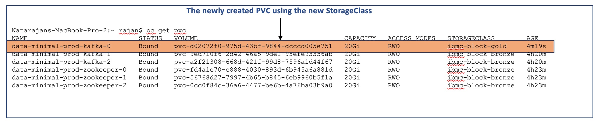
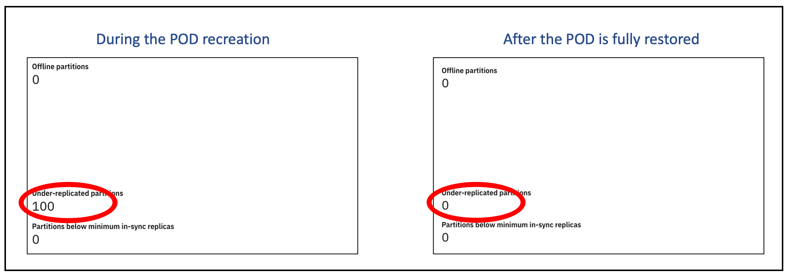

# Changing StorageClass for an existing EventStream

This document will list out the steps for changing the StorageClass of a PVC used by EventStreams. Customers may want to change their storage attached to OpenShift and hence may have to move the EventStreams data to the new storage. This article explains how to achieve this. 

## Prerequisites
1. You should have a working EventStreams pointing to an existing StorageClass. 
2. You have a new storage attached to OpenShift and a new StorageClass created.
3. All topics must have at least 3 replicas. 
4. Please note that data in topics without replications will be lost.
5. It is always recommended to create a backup of your data if you are working in a production environment. 

## Procedure
1. Take note of the current StorageClass settings.    
 	`oc get pvc`
2. Change the StorageClass setting in the Custom Resource.      
	Edit the EventStreams CR and change the following 2 settings. Point them to the newly created StorageClass.   
	`spec.strimziOverrides.kafka.storage.class.`  
	`spec.strimziOverrides.zookeeper.storage.class.`  
3. Change the StorageClass setting in the StatefulSet.   
	The StatefulSets is controlled by the Operator and hence we will not be able to change it directly. Hence, we will need to delete and let it recreate. Deleting the StatefulSets means pods/pvcs being deleted and hence loss of data. So, we will reset the StatefulSets with the --cascade flag. Issue these commands to reset the StatefulSets.   
	
	> kubectl get sts.  
	> kubectl delete sts minimal-prod-kafka --cascade=orphan.  
	> kubectl delete sts minimal-prod-zookeeper --cascade=orphan.  
	> kubectl get sts.  
	
	This may take a few minutes. Check the StatefulSets (YAML view) and confirm that the storageClassName points to the new StorageClass. 
4. Recreate the PODs one-by-one.   
	First delete the PVC associated to the pod.   
	`kubectl delete pvc data-minimal-prod-kafka-0`.  
	Then, delete the POD.    
	`kubectl delete pods minimal-prod-kafka-0`.  
	This will create a new PVC (using the new StorageClass) and bring up the POD. 
	.  
	Monitor the "Under-Replicated-Partitions" in the EventStreams web portal (Under the Monitoring tab).  Wait until this value becomes zero before proceeding to the next pod. The time take for this step will depend on the number of topics and volume of messages in that pod.    
	  
	For Zookeepers, just monitor the pod health.   
5. Repeat step 4 for every Kafka and ZooKeeper pods. 